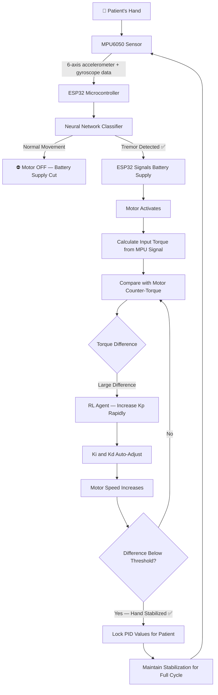
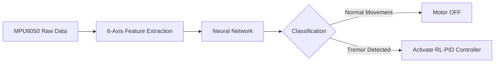
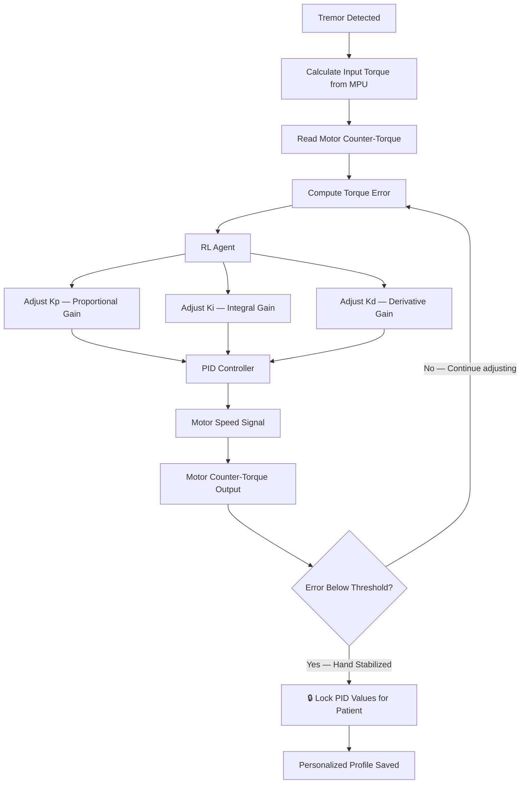

# 🤚 RL-Based Tremor Stabilization Device for Parkinson's Patients

> **Intelligent IoT wearable** combining a neural network tremor 
> classifier with a Reinforcement Learning-optimized PID controller 
> — automatically detecting tremors and stabilizing hand movement 
> through adaptive motor control personalized to each patient.

---

## 📊 Results

| Metric | Value |
|--------|-------|
| Tremor classification accuracy | 92% |
| Reduction in tremor intensity | 60% |
| Sensor | MPU6050 — 6-axis IMU |
| Microcontroller | ESP32 |
| Patient adaptation | Personalized PID locking per patient |
| Power efficiency | Motor activates ONLY when tremor detected |

---

## 🏗️ System Architecture

---

## 🧠 Two-Stage AI System

### Stage 1 — Neural Network Tremor Classifier

The neural network is trained to distinguish between:
- **Normal movement** — intentional daily activities (eating, writing, reaching)
- **Tremor movement** — involuntary oscillatory hand tremors

**Achieved 92% classification accuracy** on real patient tremor data.

---

### Stage 2 — RL-Optimized PID Controller

**How the RL agent works:**
- When large torque difference detected → **Kp increases rapidly** for strong correction
- As difference shrinks → **Ki and Kd self-adjust** for smooth stabilization
- Once hand stabilized below threshold → **PID values locked** for that patient
- Locked values become the patient's **personalized stabilization profile**
- Each patient gets their own optimal PID parameters

---

## ⚡ Key Features

- **Power efficient** — motor only activates when tremor is detected, 
  not continuously running
- **Patient-specific adaptation** — RL agent finds optimal PID values 
  per patient and locks them for the entire session
- **Real-time processing** — ESP32 runs inference and control loop 
  simultaneously
- **Dual AI system** — neural network for detection + RL for adaptive 
  control
- **Non-intrusive** — wearable form factor, lightweight, battery-powered

---

## 🛠️ Tech Stack

| Layer | Technology |
|-------|-----------|
| Microcontroller | ESP32 |
| Motion Sensor | MPU6050 — 6-axis IMU |
| Tremor Classifier | Neural Network (PyTorch) |
| Control System | RL-optimized PID Controller |
| ML Framework | PyTorch, scikit-learn |
| Embedded Code | C++ (Arduino framework) |
| Data Processing | Python, NumPy |
| Actuator | DC Motor with PWM control |

---

## 📸 Results & Demo

> Demo and results coming soon

---

## 🎓 Project Context

Built as **Final Year Project at NUST** 
(National University of Sciences & Technology) — 
one of Pakistan's top engineering universities.

Specialized in: Machine Learning · Deep Learning · 
Reinforcement Learning · Embedded Systems

---

> ⚠️ **Note:** Hardware implementation and trained model weights 
> are part of the physical prototype. Code available on request.

---

## 📫 Contact

**Adnan Abdullah** — Agentic AI Engineer & AI Team Lead

---

*Built at NUST · 92% tremor classification accuracy · 
60% reduction in tremor intensity · 
Personalized RL-PID adaptation per patient*
